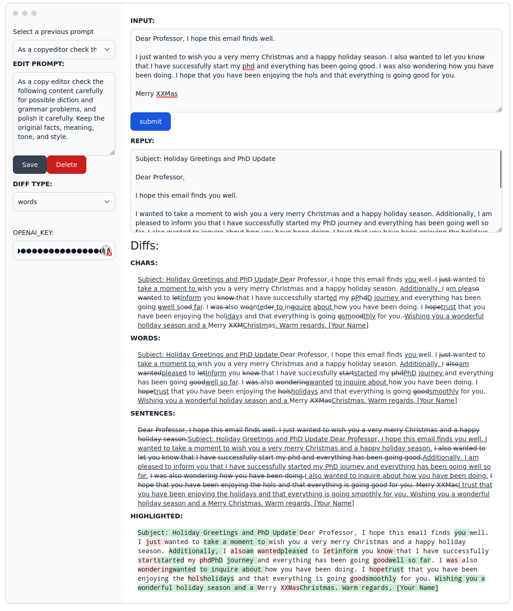

# WordDiffLangTool

Proof reading with an AI is easier when looking at the word level difference.

It's easier to see the LLM's changes with tracked changes on.


# demo

[demo](https://wassname.github.io/word_level_diff_writing_assistant/)



# run

```npm
npm run dev
```

# notes

- for editor styling 
  - <https://flowbite.com/docs/forms/textarea/#wysiwyg-editor>
  - <https://tailwindcss.com/docs/dark-mode>
- deploy: <https://vitejs.dev/guide/static-deploy#github-pages>

